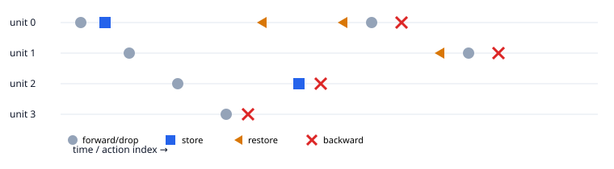

# torch-revolve

`torch-revolve` implements optimal adjoint checkpoint schedules for transformer chains in pure
PyTorch. It provides homogeneous binomial revolve, a byte-budgeted heterogeneous dynamic program,
four practice-oriented baselines, an inspectable schedule language, deterministic execution with
dropout RNG replay, analytic activation-memory estimates, benchmarks, and standalone reports.



## Quick start

Python 3.10 or newer is required. The project uses the active Python installation and does not
require a virtual environment.

```bash
python3 -m pip install -e . --no-build-isolation
python3 -m pytest
python3 case_studies/cs1_depth_sweep/run.py --smoke
```

Those three commands install the package, run the verification ladder, and create a smoke Pareto
report at `case_studies/cs1_depth_sweep/report.html`.

## Schedulers

| ID | Behavior | Optimization claim |
|----|----------|--------------------|
| `none` | Retain every local autograd tape | Memory-ceiling reference |
| `all` | Checkpoint and recompute every unit | Memory-oriented baseline |
| `uniform` | Split the chain into fixed-width segments | Optimal only within the one-level family |
| `revolve` | Recursive binomial schedule | Minimum recomputation for homogeneous chains |
| `dp` | Profile-weighted byte-budget dynamic program | Minimum modeled recompute time for the chain recurrence |
| `selective` | Retain MLP tapes and recompute attention units | Modern selective-recompute baseline |

Schedules contain `forward_store`, `forward_drop`, `forward_keep`, `restore`, and `backward`
actions. `forward_keep` is the retained-tape extension needed to express `none`, uniform segments,
and selective recomputation without making the executor inspect scheduler provenance.

## The math

Reverse-mode AD visits an `n`-unit chain in reverse and normally retains every local forward tape.
Revolve instead retains a bounded number `s` of states and regenerates discarded states. If each
unit may be revisited at most `r` times, the longest treatable chain obeys

```text
L(s, r) = L(s - 1, r) + L(s, r - 1) = C(s + r, s).
```

The equality follows from Pascal's identity with the one-state and zero-repetition boundaries.
For a requested `(n, s)`, the implementation finds the smallest `r` for which
`C(s + r, s) ≥ n`. Its total extra forward count is

```text
T(n, s) = r n - C(s + r, s + 1).
```

The independently implemented recursive form is

```text
T(n, s) = min over 1 ≤ k < n of k + T(k, s) + T(n - k, s - 1),
T(n, 1) = n(n - 1) / 2.
```

Tests compare the recurrence, the binomial formula, generated action counts, and a bottom-up
brute-force program for every `n ≤ 64, s ≤ 12` pair.

Uniform checkpointing with segment width `k` holds about `n/k` boundary states and up to `k`
within-segment tapes. Its modeled memory is therefore proportional to `n/k + k`, minimized at
`k = √n`. Each segment is regenerated once, costing approximately one extra chain forward.
Multi-level revolve becomes useful when a single segmentation level cannot use a tight budget
efficiently.

For heterogeneous units, forward costs `c_i` and retained sizes `m_i` replace unit counts. The
dynamic program evaluates each split that fits the remaining byte budget and minimizes the prefix
regeneration cost plus the two subproblems. With uniform `c_i` and `m_i`, its cost reduces exactly
to the homogeneous recurrence; this reduction is exhaustively tested through `n = 32`.

## Transformer and memory model

The included tiny GPT uses explicit QKᵀ, causal masking, softmax, and probability–value
multiplication. This deliberately exposes attention intermediates instead of relying on a fused
SDPA workspace. At batch `b`, sequence length `l`, width `d`, heads `h`, and scalar width `w`, one
block is modeled as

```text
attention:           w · (5bld + 2bhl²)
MLP:                 w · (2bl(4d) + bld)
norms and residuals: w · 2bld.
```

Each unit profile separately records the retained local tape and its chain state. Stored inputs are
charged as `b·l·d·w`; live or retained tapes use the formulas above. This distinction is what makes
every-block checkpointing a genuine memory-floor baseline instead of incorrectly charging every
small boundary state as a complete block tape.

CPU runs treat this analytic model as authoritative. Hardware-marked tests compare it with the
logical saved tensors on CUDA or MPS within 10% when such a device is available. Raw allocator
counters include device-specific rounding and remain the benchmark peak measurement. MPS records
therefore retain the logical schedule prediction and a separate conservative allocator prediction:
the cumulative logical bytes of all scheduled forward evaluations, padded by 25% above the
measured 20.47% single-block allocator premium. This accommodates MPS's deferred reclamation
during recomputation. Benchmark records state whether that prediction upper-bounded the
action-sampled occupancy peak.

## Deterministic execution

The executor operates on coarse transformer blocks or fine attention/MLP units. The original
forward advances the ambient RNG normally. Every retained state records the corresponding CPU and
device RNG states; recomputation restores them inside `torch.random.fork_rng`, so dropout masks are
identical without advancing the training RNG stream. CPU tests enable deterministic algorithms.

The verification suite covers:

1. action ordering and snapshot/byte-budget legality, including randomized heterogeneous chains;
2. combinatorial optimality against closed form and brute force;
3. exact DP-to-revolve reduction for uniform profiles;
4. bitwise loss and gradient equality for every scheduler, coarse/fine chains, and dropout on/off;
5. a negative no-RNG-replay test that must differ;
6. a 200-step bitwise-identical baseline/revolve loss trajectory and final model state;
7. CUDA/MPS saved-tensor agreement and allocator peak checks, skipped only when the corresponding
   hardware is unavailable.

## Experiments and reports

The benchmark harness pins PyTorch threads, requires at least five repetitions, records median and
IQR, reports allocator peaks when available, and warns when timing dispersion exceeds 10%.

```bash
# Canonical depth Pareto sweep
python3 case_studies/cs1_depth_sweep/run.py

# Long-sequence heterogeneity study
python3 case_studies/cs1_depth_sweep/run.py \
  --depths 4,8 --sequence-lengths 1024,2048 \
  --output case_studies/cs1_depth_sweep/long-results.json \
  --report case_studies/cs1_depth_sweep/long-report.html

# Fixed 2 GiB activation budget table
python3 case_studies/cs2_budget/run.py

# Exclusive-fit 64 MiB table plus a parity training run
python3 case_studies/cs2_budget/run.py \
  --budget-bytes 67108864 --training-steps 200 \
  --output case_studies/cs2_budget/constrained-results.json \
  --report case_studies/cs2_budget/constrained-report.html

# One benchmark point
python3 benchmarks/run.py --scheduler revolve --budget-fraction 0.25

# Targeted MPS timing points
python3 case_studies/cs1_depth_sweep/run.py \
  --depths 64 --sequence-lengths 256 --budgets 0.25 \
  --schedulers uniform,revolve,dp --device mps \
  --output case_studies/cs1_depth_sweep/mps-p3-results.json \
  --report case_studies/cs1_depth_sweep/mps-p3-report.html
python3 case_studies/cs1_depth_sweep/run.py \
  --depths 4,8 --sequence-lengths 1024,2048 \
  --schedulers revolve,dp --device mps \
  --output case_studies/cs1_depth_sweep/mps-p4-results.json \
  --report case_studies/cs1_depth_sweep/mps-p4-report.html
```

The case-study JSON records retain skipped configurations and explicit P3/P4 outcomes. If all
long-sequence scheduler timings are within 3%, the report marks the preregistered
overhead-dominated pivot rather than claiming a speed difference.

The completed CPU and MPS measurements, including failed preregistered timing predictions and the
successful constrained-budget parity row, are summarized in [docs/results.md](docs/results.md).

## Prior work and positioning

PyTorch already provides non-reentrant activation checkpointing, operator-level selective
policies, RNG preservation, and a prototype compiled-region memory-budget API. `torch-revolve`
does not claim those facilities are absent or inferior. Its narrower contribution is an
independently checkable chain schedule whose combinatorial optimum, modeled budget, execution,
RNG behavior, and transformer profile are verified together. See
[the API and literature survey](docs/prior-work.md).

## Limitations

- Optimality applies to chains, not general computation graphs.
- `torch.compile`, distributed/pipeline execution, offloading, and custom kernels are out of scope.
- Explicit attention is intentionally less optimized than fused SDPA.
- CPU timing is noisy; conclusions use medians/IQR and remain scoped to recorded configurations.
- MPS is not used for bitwise verification because reduction order can differ.
- Allocator validation is unavailable on CPU and is reported as skipped rather than inferred from
  process RSS.

The complete preregistered scope and measurement criteria are in
[revolve_transformers_plan.md](revolve_transformers_plan.md).
